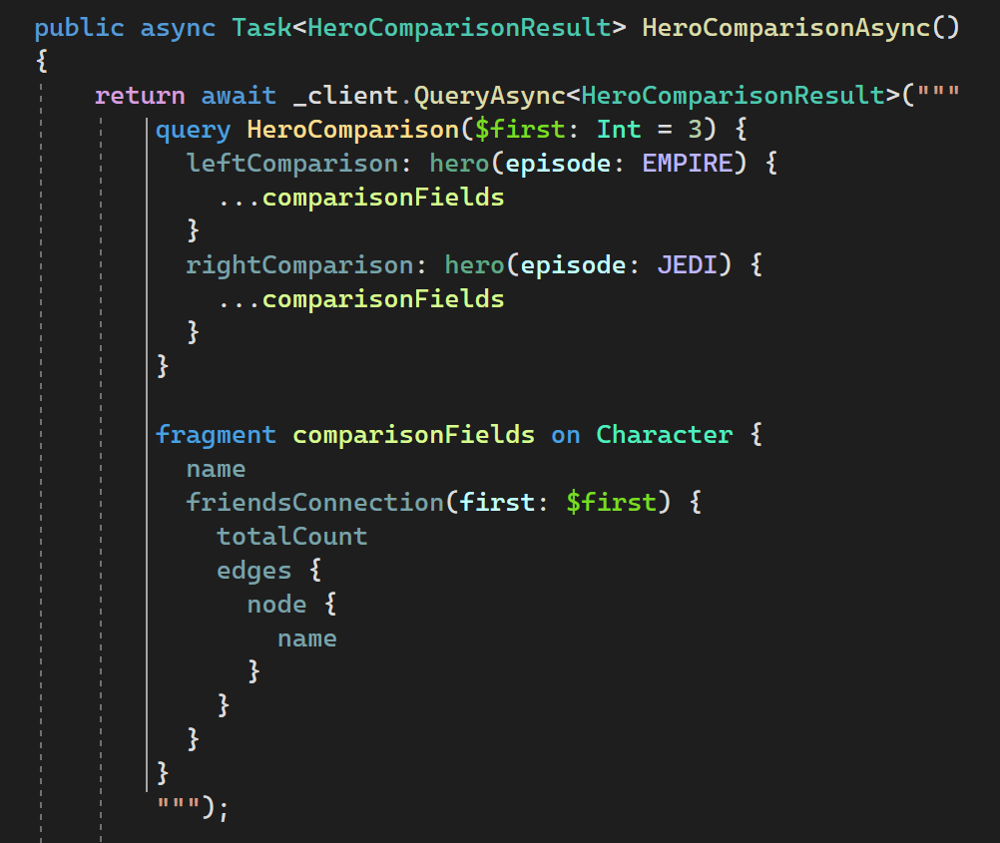

# GraphQLTools

GraphQLTools is a Visual Studio 2022 extension designed to provide GraphQL support for the `StringSyntaxAttribute` [feature]([http](https://github.com/dotnet/runtime/issues/62505)) introduced in .NET 7.

Currently, there is no native support for GraphQL formatting and syntax highlighting, so that's where GraphQLTools comes in. By decorating your string parameters with `[StringSyntax("GraphQL")]` you can incorporate GraphQL syntax highlighting and checking into your C# code.

## Features and limitations

GraphQLTools enhances the coding experience by classifying various components of GraphQL documents using distinct syntax highlighting for

- Punctuators
- Contextual keywords (like `query`, `fragment`, `on`)
- Operation names
- Fragment names
- Variable names
- Directive names
- Type names
- Field names
- Aliased field names
- Argument names
- Object field names
- Strings
- Numbers
- Enums
- Comments

In addition to syntax highlighting, the extension helps identifies syntax errors with diagnostic error messages displayed in tooltips upon mouse hover.

Like in the native feature, regular, verbatim and raw string literals are supported, while interpolated strings are not.

Currently, it works only when the attribute is used on parameters. However, we are planning to extend support for properties and fields in the near future. It's worth noting that the `StringSyntax` attribute allows flexibility in the casing of the `syntax` parameter within the attribute's constructor. For example, both `[StringSyntax("GraphQL")]` and `[StringSyntax("graphql")]` are valid.
